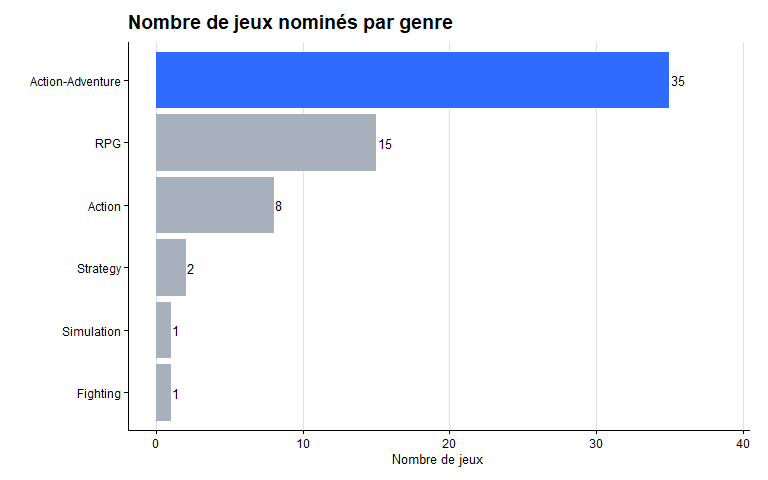
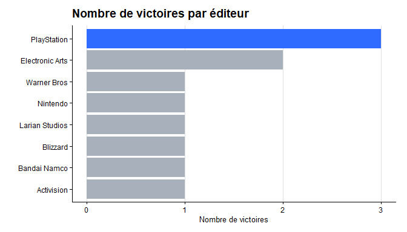
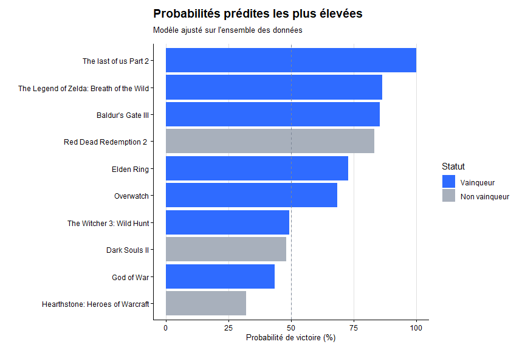
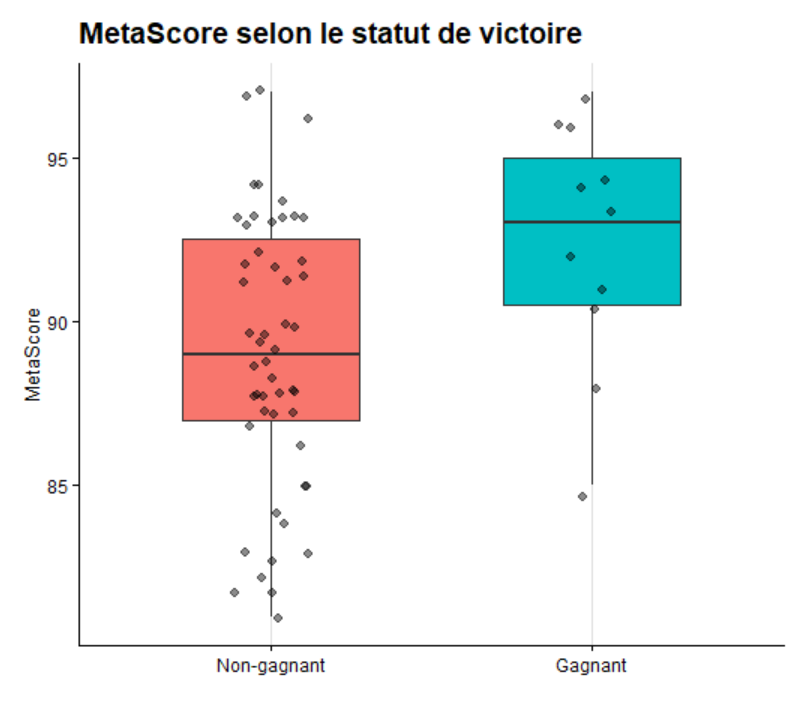
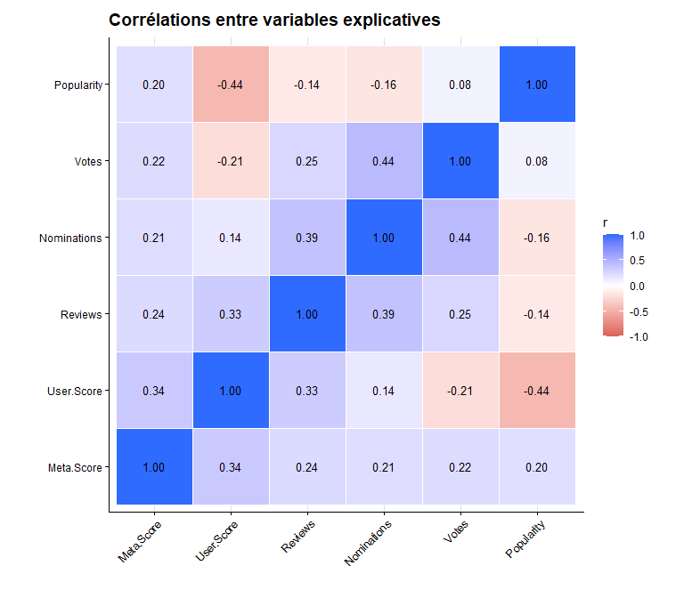
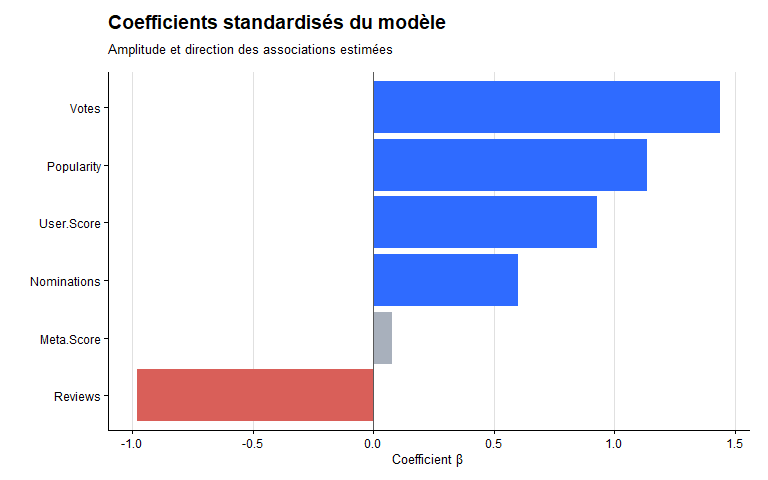
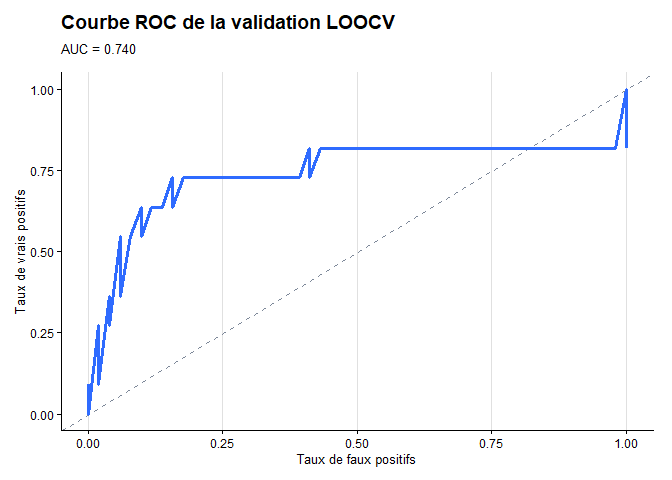

# Analyse des vainqueurs du Game of the Year

Analyse statistique des jeux nommés aux **Game of the Year Awards entre 2014 et 2024**, réalisée en R.

L'objectif est d'identifier les caractéristiques associées à la probabilité qu'un jeu remporte le GOTY, tout en évaluant les limites d'un modèle construit sur un échantillon relativement réduit.

## Données

-   62 jeux analysés
-   11 gagnants
-   6 variables explicatives : `Meta Score`, `User Score`, `Reviews`, `Nominations`, `Votes`, `Popularity`
-   Variable cible : victoire au GOTY (`Wins`)

## Méthode

L'analyse combine :

-   statistiques descriptives et visualisations
-   matrice de corrélation
-   analyse de multicolinéarité avec les VIF
-   régression logistique
-   coefficients standardisés et analyse des p-values
-   validation Leave-One-Out Cross Validation (LOOCV)
-   matrice de confusion, Recall, Precision, F1 et Balanced Accuracy
-   courbes ROC et AUC
-   prédictions sur le vainqueur du trophée en 2025

## Quelques résultats

Le modèle obtient une **AUC de 0,740** en validation LOOCV.

L'accuracy atteint **83,9 %**, mais elle doit être interprétée avec prudence puisque seulement **17,7 % des jeux sont gagnants**. Le Recall est de **36,4 %**, ce qui montre que le modèle identifie encore difficilement les gagnants.

Les coefficients standardisés donnent les associations les plus fortes à `Votes` et `Popularity`. La multicolinéarité reste limitée dans les données, avec des VIF tous inférieurs à 3.

### Visualisations

**Répartition des jeux par genre et nombre de victoires par éditeur**

Ce graphique montre la répartition des jeux analysés selon leur genre. Les jeux d'action-aventure sont les plus représentés dans l'échantillon et l'éditeur ayant remporté le plus de trophées est Playstation.

**Probabilités les plus élevées prédites par notre modèle**

Ce graphique présente les jeux auxquels le modèle final attribue les probabilités de victoire les plus élevées. A titre de comparaison, **Clair Obscur: Expedition 33** (le vainqueur du trophée en 2025) obtient une probabilité de victoire de 90.7% par notre modèle, se glissant en deuxième position de ce classement.

**Distribution du Meta Score selon la victoire**

Les gagnants et les non-gagnants sont comparés selon leur `Meta Score`. Le boxplot permet d'observer que le groupe de gagnants obtient en moyenne un Meta Score supérieur au groupe Non-gagnant sur notre échantillon.

**Corrélations entre les variables**

La matrice de corrélation permet d'identifier les relations entre les variables explicatives. Les corrélations restent modérées, ce qui est cohérent avec des VIF tous inférieurs à 3 et ne suggère pas de problème majeur de multicolinéarité.

**Coefficients standardisés du modèle**

`Votes` et `Popularity` présentent les coefficients positifs les plus élevés, tandis que `Reviews` présente une association négative estimée.

**Performance ROC du modèle**

La courbe ROC présente la capacité du modèle à distinguer les gagnants des non-gagnants selon différents seuils de décision. L'AUC de **0,740** indique une capacité de discrimination supérieure au hasard, mais l'estimation doit rester prudente compte tenu du faible nombre de gagnants.

## À retenir

Les résultats suggèrent une association entre les variables d'engagement de la communauté et la victoire, mais ils restent exploratoires dûs à la taille de l'échantillon.

Le modèle classe correctement une grande partie des non-gagnants, mais détecte seulement 4 des 11 gagnants en validation LOOCV. L'accuracy seule est donc insuffisante pour juger sa qualité.

Une observation supplémentaire sur **Clair Obscur: Expedition 33 (2025)** est utilisée pour illustrer le comportement du modèle sur une donnée hors échantillon. Le modèle lui attribue une probabilité de victoire de **90.7%**. Cette prédiction doit être considérée comme une illustration et non comme une preuve de robustesse.
